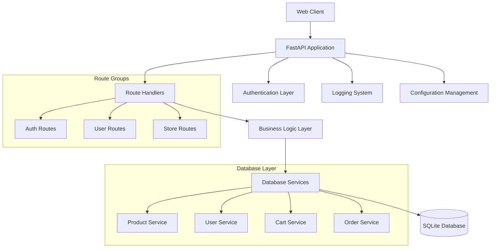

# Design Document: spoXpro E-commerce Backend

## Overview

The spoXpro backend is a FastAPI-based e-commerce platform designed for sports clothing retail. The system implements a layered architecture with clear separation between API endpoints, business logic, data access, and configuration management. The design supports both authenticated users and guest users through cookie-based sessions, providing a seamless shopping experience.

The architecture follows RESTful principles with comprehensive data validation, structured logging, and robust error handling. The system uses SQLite with synchronous SQLAlchemy for data persistence, JWT tokens for user authentication, and cookies for guest session management.

## Architecture

### High-Level Architecture



### Directory Structure

```
backend/
├── db/                     # Database layer
│   ├── main.py            # DB initialization and session management
│   ├── models/            # SQLAlchemy ORM models
│   │   ├── __init__.py
│   │   ├── product.py     # Product and related models
│   │   ├── user.py        # User and auth models
│   │   └── order.py       # Order and cart models
│   └── services/          # Database service layer
│       ├── __init__.py
│       ├── product_service.py
│       ├── user_service.py
│       ├── cart_service.py
│       └── order_service.py
├── routes/                # API endpoint handlers
│   ├── __init__.py
│   ├── auth.py           # Authentication endpoints
│   ├── user.py           # User profile and cart endpoints
│   └── store.py          # Product and store endpoints
├── service/              # Business logic layer
│   ├── __init__.py
│   ├── auth_service.py   # Authentication business logic
│   ├── cart_service.py   # Cart management logic
│   ├── product_service.py # Product management logic
│   └── order_service.py  # Order processing logic
├── DTO/                  # Pydantic models for API
│   ├── __init__.py
│   ├── auth.py          # Authentication DTOs
│   ├── user.py          # User and cart DTOs
│   └── store.py         # Product and store DTOs
├── config/              # Configuration management
│   ├── __init__.py
│   ├── settings.py      # Application settings
│   └── database.py      # Database configuration
├── logging/             # Logging system
│   ├── __init__.py
│   ├── log_store.py     # Logging configuration
│   └── log_file/        # Log files directory
├── admin/               # Admin panel structure
├── main.py              # Application entry point
└── docs.py              # API documentation
```

## Components and Interfaces

### Database Models

#### Product Model
```python
class Product(Base):
    id: int (Primary Key)
    name: str
    description: str
    product_type_id: int (Foreign Key -> ProductType)
    category_id: int (Foreign Key -> Category)
    sport_type_id: int (Foreign Key -> SportType)
    color: str
    gender: str (male/female/unisex)
    brand: str (default: "spoXpro")
    price: decimal
    reviews: JSON
    article_number: str (unique)
    images: JSON (list of strings)
    material_id: int (Foreign Key -> Material)
    created_date: datetime
    last_updated_date: datetime
    product_views: int (default: 0)
    
    # Size-specific inventory
    sizes: relationship -> ProductSize
```

#### ProductSize Model
```python
class ProductSize(Base):
    id: int (Primary Key)
    product_id: int (Foreign Key -> Product)
    size: str (XXS, XS, S, M, L, XL, XXL, XXXL, XXXXL)
    quantity: int
```

#### Helper Models
```python
class ProductType(Base):
    id: int (Primary Key)
    name: str (unique)

class Category(Base):
    id: int (Primary Key)
    name: str (unique)

class SportType(Base):
    id: int (Primary Key)
    name: str (unique)

class Material(Base):
    id: int (Primary Key)
    name: str (unique)
```

#### User Model
```python
class User(Base):
    id: int (Primary Key)
    email: str (unique)
    password_hash: str
    phone: str
    cookie: str (nullable, for guest users)
    created_date: datetime
    
    # Relationships
    cart_items: relationship -> CartItem
    orders: relationship -> Order
```

#### Cart Model
```python
class CartItem(Base):
    id: int (Primary Key)
    user_id: int (Foreign Key -> User, nullable)
    cookie: str (nullable, for guest users)
    product_id: int (Foreign Key -> Product)
    size: str
    quantity: int
    added_date: datetime
```

#### Order Models
```python
class Order(Base):
    id: int (Primary Key)
    user_id: int (Foreign Key -> User)
    total_amount: decimal
    status: str
    created_date: datetime
    
    # Relationships
    items: relationship -> OrderItem

class OrderItem(Base):
    id: int (Primary Key)
    order_id: int (Foreign Key -> Order)
    product_id: int (Foreign Key -> Product)
    size: str
    quantity: int
    price_at_time: decimal
```

#### Verification Model
```python
class VerificationCode(Base):
    id: int (Primary Key)
    email: str
    code: str
    created_date: datetime
    expires_at: datetime
```

### API Endpoints Structure

#### Authentication Routes (`/auth`)
- `POST /auth/register` - User registration
- `POST /auth/login` - User login
- `POST /auth/verify` - Email verification
- `POST /auth/guest-cookie` - Generate guest cookie
- `GET /auth/validate` - Validate JWT token

#### User Routes (`/user`)
- `GET /user/profile` - Get user profile
- `PUT /user/profile` - Update user profile
- `GET /user/cart` - Get cart contents
- `POST /user/cart/add` - Add item to cart
- `PUT /user/cart/update` - Update cart item quantity
- `DELETE /user/cart/remove` - Remove item from cart
- `GET /user/orders` - Get order history
- `POST /user/orders/create` - Create new order

#### Store Routes (`/store`)
- `GET /store/products` - Get products with filtering
- `GET /store/products/{id}` - Get specific product
- `GET /store/categories` - Get all categories
- `GET /store/product-types` - Get all product types
- `GET /store/sport-types` - Get all sport types
- `GET /store/materials` - Get all materials

### Business Logic Services

#### Authentication Service
```python
class AuthService:
    def register_user(email, password, phone) -> User
    def authenticate_user(email, password) -> JWT_Token
    def generate_guest_cookie() -> str
    def validate_jwt_token(token) -> User_ID
    def send_verification_code(email) -> bool
    def verify_code(email, code) -> bool
```

#### Cart Service
```python
class CartService:
    def add_to_cart(user_id/cookie, product_id, size, quantity) -> bool
    def update_cart_item(user_id/cookie, item_id, quantity) -> bool
    def remove_from_cart(user_id/cookie, item_id) -> bool
    def get_cart_contents(user_id/cookie) -> List[CartItem]
    def calculate_cart_total(user_id/cookie) -> decimal
    def clear_cart(user_id/cookie) -> bool
```

#### Product Service
```python
class ProductService:
    def get_products(filters) -> List[Product]
    def get_product_by_id(product_id) -> Product
    def increment_product_views(product_id) -> bool
    def check_inventory(product_id, size, quantity) -> bool
    def reduce_inventory(product_id, size, quantity) -> bool
```

#### Order Service
```python
class OrderService:
    def create_order(user_id, cart_items) -> Order
    def get_user_orders(user_id) -> List[Order]
    def update_order_status(order_id, status) -> bool
    def process_payment(order_id, payment_info) -> bool
```

## Data Models

### Request/Response DTOs

#### Authentication DTOs
```python
class UserRegistrationRequest(BaseModel):
    email: EmailStr
    password: str
    phone: str

class UserLoginRequest(BaseModel):
    email: EmailStr
    password: str

class AuthResponse(BaseModel):
    access_token: str
    token_type: str
    user_id: int

class GuestCookieResponse(BaseModel):
    cookie: str
    expires_at: datetime
```

#### Product DTOs
```python
class ProductResponse(BaseModel):
    id: int
    name: str
    description: str
    product_type: str
    category: str
    sport_type: str
    color: str
    gender: str
    brand: str
    price: decimal
    reviews: List[dict]
    article_number: str
    images: List[str]
    material: str
    sizes: List[ProductSizeResponse]
    product_views: int

class ProductSizeResponse(BaseModel):
    size: str
    quantity: int

class ProductFilterRequest(BaseModel):
    category: Optional[str] = None
    product_type: Optional[str] = None
    sport_type: Optional[str] = None
    color: Optional[str] = None
    gender: Optional[str] = None
    min_price: Optional[decimal] = None
    max_price: Optional[decimal] = None
    size: Optional[str] = None
```

#### Cart DTOs
```python
class AddToCartRequest(BaseModel):
    product_id: int
    size: str
    quantity: int

class CartItemResponse(BaseModel):
    id: int
    product: ProductResponse
    size: str
    quantity: int
    subtotal: decimal

class CartResponse(BaseModel):
    items: List[CartItemResponse]
    total: decimal
    item_count: int
```

#### Order DTOs
```python
class CreateOrderRequest(BaseModel):
    shipping_address: str
    payment_method: str

class OrderResponse(BaseModel):
    id: int
    items: List[OrderItemResponse]
    total_amount: decimal
    status: str
    created_date: datetime

class OrderItemResponse(BaseModel):
    product_name: str
    size: str
    quantity: int
    price_at_time: decimal
```

### Database Service Interfaces

#### Product Service Interface
```python
class ProductServiceInterface:
    def create_product(product_data) -> Product
    def get_product_by_id(product_id) -> Optional[Product]
    def get_products_filtered(filters) -> List[Product]
    def update_product(product_id, updates) -> Product
    def delete_product(product_id) -> bool
    def increment_views(product_id) -> bool
    def get_inventory(product_id, size) -> int
    def update_inventory(product_id, size, quantity_change) -> bool
```

#### User Service Interface
```python
class UserServiceInterface:
    def create_user(user_data) -> User
    def get_user_by_id(user_id) -> Optional[User]
    def get_user_by_email(email) -> Optional[User]
    def update_user(user_id, updates) -> User
    def delete_user(user_id) -> bool
    def create_verification_code(email, code) -> bool
    def verify_code(email, code) -> bool
```

#### Cart Service Interface
```python
class CartServiceInterface:
    def add_cart_item(user_id, cookie, product_id, size, quantity) -> CartItem
    def get_cart_items(user_id, cookie) -> List[CartItem]
    def update_cart_item(item_id, quantity) -> CartItem
    def remove_cart_item(item_id) -> bool
    def clear_cart(user_id, cookie) -> bool
```

#### Order Service Interface
```python
class OrderServiceInterface:
    def create_order(user_id, order_data) -> Order
    def get_order_by_id(order_id) -> Optional[Order]
    def get_user_orders(user_id) -> List[Order]
    def update_order_status(order_id, status) -> Order
    def create_order_items(order_id, items) -> List[OrderItem]
```

## Correctness Properties

*A property is a characteristic or behavior that should hold true across all valid executions of a system—essentially, a formal statement about what the system should do. Properties serve as the bridge between human-readable specifications and machine-verifiable correctness guarantees.*

### Property 1: Product Data Integrity
*For any* product data with all required fields, storing and retrieving the product should preserve all field values including name, description, type relationships, sizes with quantities, and metadata
**Validates: Requirements 1.1, 1.4**

### Property 2: Product Search Filtering
*For any* set of products and any combination of valid filter criteria (type, category, sport, color, gender, size availability, price range), the search results should contain only products that match all specified filters
**Validates: Requirements 1.2**

### Property 3: Product View Count Increment
*For any* product, viewing the product should increase its view count by exactly one from the previous count
**Validates: Requirements 1.3**

### Property 4: Database Referential Integrity
*For any* database operation involving foreign key relationships, the system should enforce referential integrity and reject operations that would violate foreign key constraints
**Validates: Requirements 1.6, 6.3**

### Property 5: User Registration and Authentication
*For any* valid user registration data (email, password, phone), the system should create a user account with properly hashed password and generate valid JWT tokens for subsequent authentication
**Validates: Requirements 2.1, 2.2, 2.6**

### Property 6: JWT Token Validation
*For any* JWT token generated by the system, token validation should correctly extract the user ID, and for any invalid or expired token, validation should fail appropriately
**Validates: Requirements 2.3**

### Property 7: Guest Cookie Management
*For any* first-time visitor without cookies, the system should generate a unique cookie, and for any returning visitor with a valid cookie, the system should retrieve their associated cart data
**Validates: Requirements 3.1, 3.2**

### Property 8: Cart Operations with Authentication
*For any* authenticated user or guest with valid cookie, cart operations (add, update, remove) should be permitted, but for guests attempting non-cart operations, the system should require full authentication
**Validates: Requirements 3.3, 3.4, 3.5**

### Property 9: Cart Data Persistence and Calculations
*For any* cart with items, the cart should persist across sessions, calculate correct totals based on item prices and quantities, and validate all operations against current inventory availability
**Validates: Requirements 4.1, 4.4, 4.6, 4.5**

### Property 10: Inventory Management During Orders
*For any* order placement, the system should reduce inventory quantities for purchased items by the exact amounts ordered, and should reject orders when insufficient inventory is available
**Validates: Requirements 5.2, 5.6, 10.4**

### Property 11: Order Creation and Completion Workflow
*For any* user checkout process, the system should create complete order records with all cart contents and user information, clear the cart upon completion, and add the order to the user's history
**Validates: Requirements 5.1, 5.3, 5.4**

### Property 12: Input Validation and Error Responses
*For any* API request with invalid data, the system should validate input using Pydantic models, reject invalid requests, and return structured error responses with appropriate HTTP status codes and consistent formatting
**Validates: Requirements 7.2, 7.4, 10.1, 10.3, 10.6**

### Property 13: Comprehensive Logging
*For any* system operation (API requests, database operations, authentication attempts, cart operations, order processing, errors), the system should generate structured log entries with timestamps, severity levels, and contextual information
**Validates: Requirements 8.1, 8.2, 8.4, 8.5**

### Property 14: Configuration Management and Security
*For any* application startup, the system should load and validate all required configuration parameters, and should never expose sensitive configuration data (JWT secrets, API keys) in logs or API responses
**Validates: Requirements 9.4, 9.6**

### Property 15: Admin Authorization and Logging
*For any* administrative operation, the system should verify admin privileges, execute the operation only for authorized admin users, and log all admin actions with user identification
**Validates: Requirements 11.2, 11.4, 11.5**

### Property 16: Concurrent Access Safety
*For any* simultaneous operations on shared resources (inventory, cart, orders), the system should prevent data corruption and maintain data consistency across concurrent access scenarios
**Validates: Requirements 10.5**

## Error Handling

### Error Categories

#### Validation Errors (400 Bad Request)
- Invalid input data format
- Missing required fields
- Invalid foreign key references
- Business rule violations (e.g., insufficient inventory)

#### Authentication Errors (401 Unauthorized)
- Invalid JWT tokens
- Expired tokens
- Missing authentication for protected endpoints

#### Authorization Errors (403 Forbidden)
- Guest users accessing non-cart operations
- Non-admin users accessing admin endpoints
- Insufficient permissions for requested operation

#### Resource Errors (404 Not Found)
- Product not found
- User not found
- Order not found
- Invalid endpoint

#### Conflict Errors (409 Conflict)
- Email already exists during registration
- Concurrent modification conflicts
- Inventory conflicts during order placement

#### Server Errors (500 Internal Server Error)
- Database connection failures
- Unexpected system errors
- Configuration errors

### Error Response Format

All API errors follow a consistent JSON structure:

```json
{
  "error": {
    "code": "ERROR_CODE",
    "message": "Human-readable error description",
    "details": {
      "field": "specific field error details",
      "validation_errors": ["list of validation issues"]
    },
    "timestamp": "2024-01-01T12:00:00Z",
    "request_id": "unique-request-identifier"
  }
}
```

### Error Handling Strategy

1. **Input Validation**: Use Pydantic models for automatic validation with detailed error messages
2. **Database Errors**: Catch SQLAlchemy exceptions and convert to appropriate HTTP responses
3. **Business Logic Errors**: Implement custom exceptions for business rule violations
4. **Logging**: Log all errors with sufficient context for debugging
5. **User Experience**: Provide clear, actionable error messages without exposing system internals

## Testing Strategy

### Dual Testing Approach

The testing strategy employs both unit testing and property-based testing as complementary approaches:

- **Unit tests**: Verify specific examples, edge cases, and error conditions
- **Property tests**: Verify universal properties across all inputs
- Together they provide comprehensive coverage where unit tests catch concrete bugs and property tests verify general correctness

### Property-Based Testing Configuration

- **Testing Library**: Use `hypothesis` for Python property-based testing
- **Test Iterations**: Minimum 100 iterations per property test to ensure thorough randomized input coverage
- **Test Tagging**: Each property test must reference its design document property with the format:
  - **Feature: spoxpro-backend, Property {number}: {property_text}**

### Unit Testing Focus Areas

Unit tests should concentrate on:
- Specific examples that demonstrate correct behavior
- Integration points between components (API → Service → Database)
- Edge cases and error conditions
- Authentication and authorization flows
- Database constraint enforcement

### Property Testing Focus Areas

Property tests should verify:
- Data integrity across all CRUD operations
- Search and filtering correctness for any input combination
- Authentication and authorization for any valid/invalid credentials
- Cart operations for any product and quantity combinations
- Order processing for any cart contents
- Error handling consistency across all endpoints

### Test Organization

```
tests/
├── unit/
│   ├── test_auth_service.py
│   ├── test_cart_service.py
│   ├── test_product_service.py
│   └── test_order_service.py
├── property/
│   ├── test_product_properties.py
│   ├── test_auth_properties.py
│   ├── test_cart_properties.py
│   └── test_order_properties.py
├── integration/
│   ├── test_api_endpoints.py
│   └── test_database_integration.py
└── fixtures/
    ├── product_fixtures.py
    └── user_fixtures.py
```

### Test Data Generation

Property tests will use Hypothesis strategies to generate:
- Valid and invalid product data with all field combinations
- User credentials and authentication tokens
- Cart operations with various product and quantity combinations
- Order scenarios with different cart contents
- API requests with valid and invalid payloads

This comprehensive testing approach ensures both specific functionality works correctly and general system properties hold across all possible inputs.